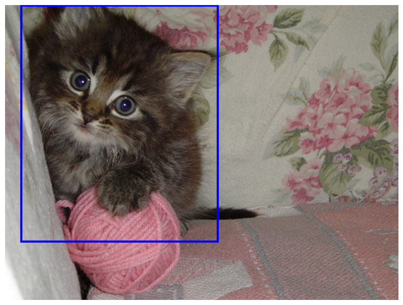
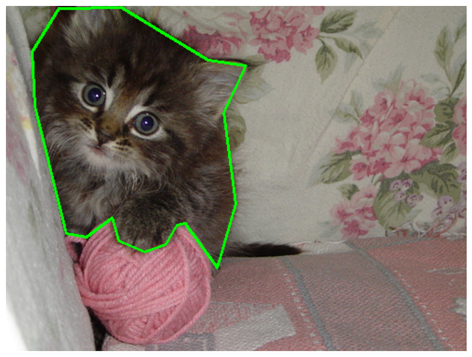
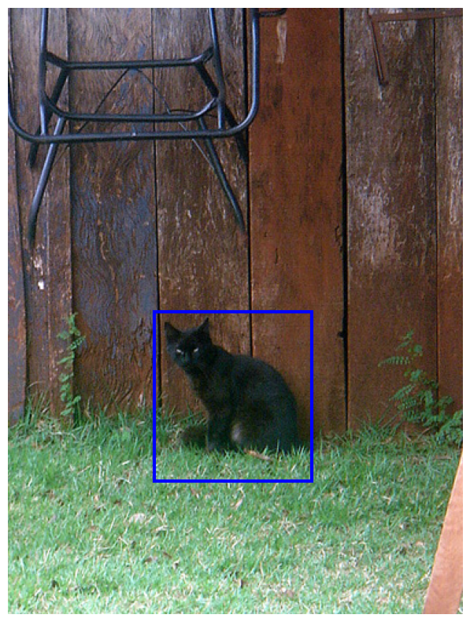
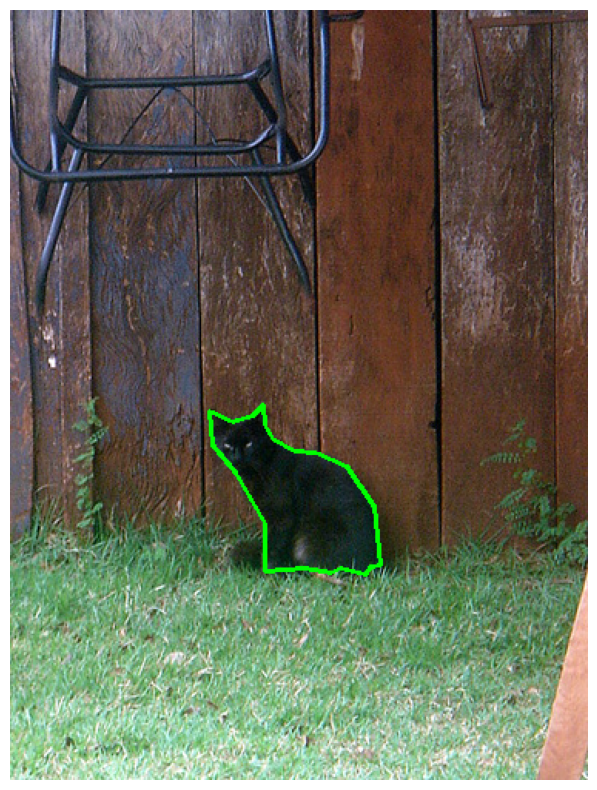
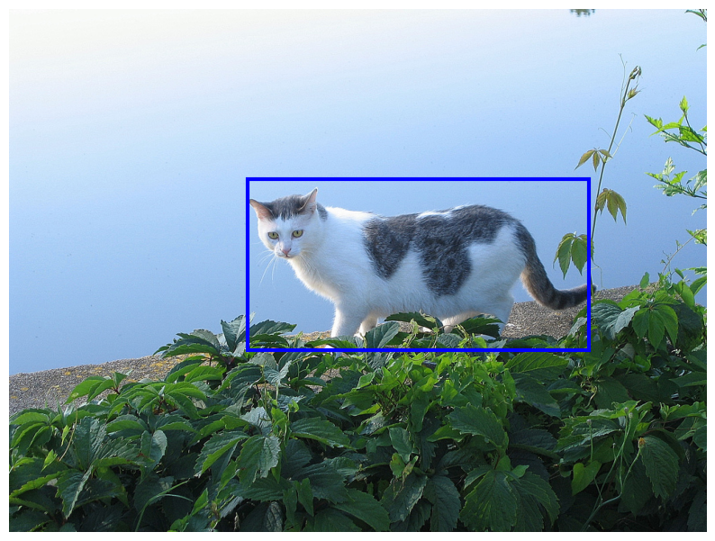
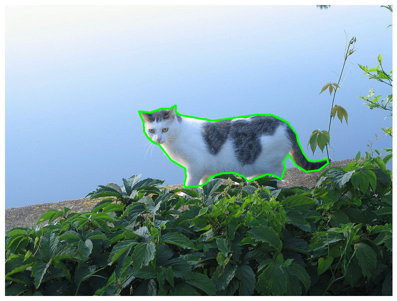

# Description

This repo contains code to convert YOLO detection dataset (xywh-format) to YOLO segmentation dataset. The code works on Linux.

For conversion, the Segment Anything Model from Meta is used. Here original repo https://github.com/facebookresearch/segment-anything
<div align="center">
    
    
</div>

# Requirements

Python 3.11 or later with all pyproject.toml dependencies and poetry installed. To install run:

`$ poetry install`

# Usage

Run in the terminal

`$ python main.py dataset_path --device 0 --weights sam_vit_h_4b8939.pth --model_type vit_h`

The dataset should have the following structure:

```
dataset_folder
├── images
│   ├── *.jpg
└── labels
    ├── *.txt
```

New labeling will be saved in `dataset/segmentation_labels/`.

The checkpoint for the model can be obtained from this link https://github.com/facebookresearch/segment-anything#model-checkpoints

# Some more examples

<div align="center">
    
    
</div>
<div align="center">
    
       
</div>

# Citation

SAM repository: https://github.com/facebookresearch/segment-anything
YOLO repository: https://github.com/ultralytics/ultralytics
